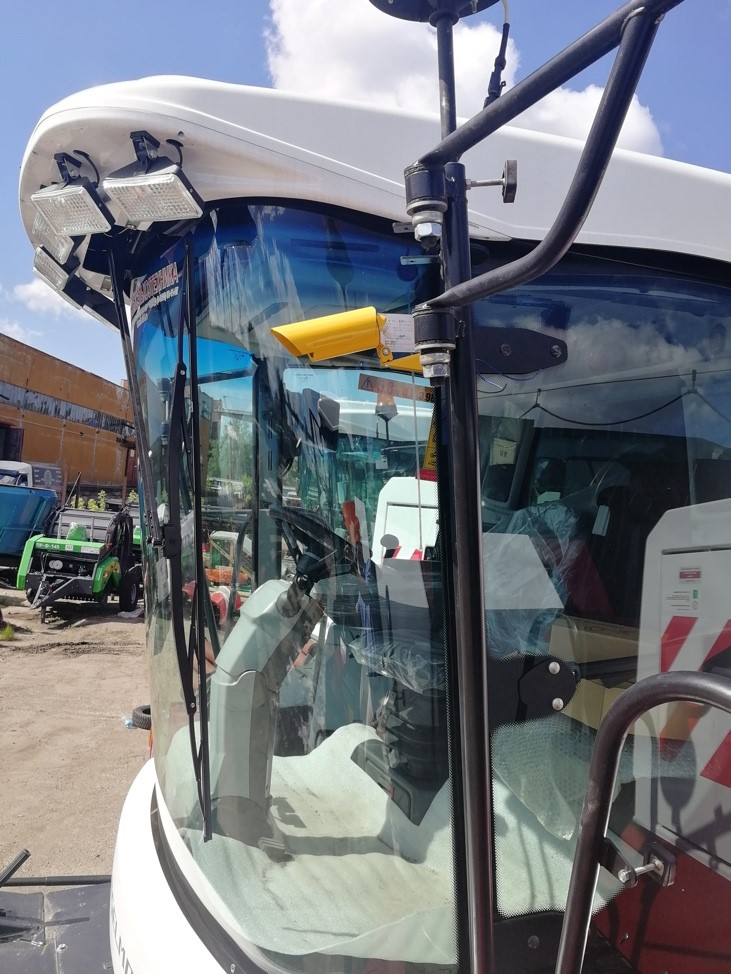
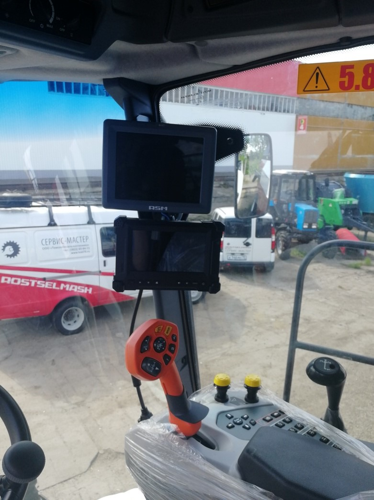
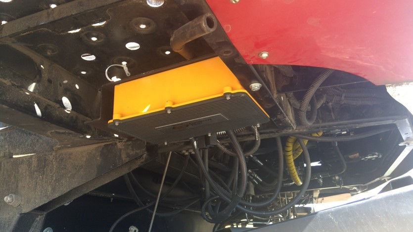
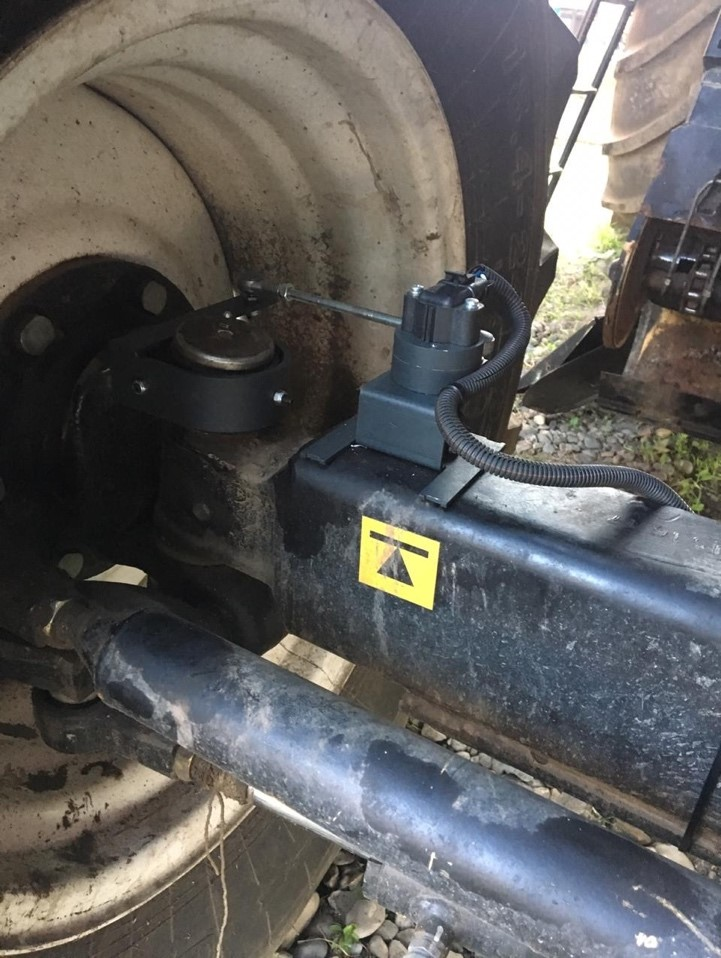
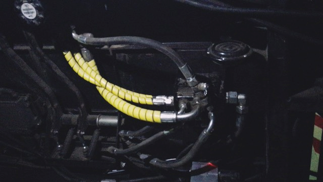

# Cognitive Agro Pilot

_Report on the Application of Artificial Intelligence in Russian Agriculture: Example of the Cognitive Agro Pilot_

The Cognitive Agro Pilot system, developed in Russia, represents a more advanced solution for the autonomous control of agricultural machinery. It significantly enhances the efficiency of agribusiness, but also raises important ethical questions that need to be considered during its implementation.

## Description of Cognitive Agro Pilot

The Cognitive Agro Pilot system is a solution for the autonomous management of agricultural machinery. It utilizes artificial intelligence algorithms to analyze images obtained from cameras, allowing for the accurate identification of objects in the field and the construction of safe operational routes for machinery. Currently, this system has been implemented in over 1,000 units of machinery in Russia and other countries.

### Advantages of Application

The use of Cognitive Agro Pilot in agriculture offers several significant advantages:

- Increased Productivity: Due to automatic control, human error is reduced, and the speed of agricultural operations is increased.
- Resource Savings: The system enables optimal distribution of resources such as fuel and fertilizers, leading to reduced costs and enhanced efficiency.
- Improved Crop Yields: The use of AI helps to identify and process areas that require attention, thereby increasing crop yields.

### Hydraulic autopilot for tractor:

- 2 cm movement accuracy with RTK corrections.
  In the presence of a satellite navigation signal, advanced control algorithms drive the car along the course line with an accuracy of 2 – 5 cm, despite the shaking and the relief of the field. RTK corrections will be reliably delivered via GSM or radio communication.
- 4 modes
  driving with the help of technical vision based on artificial intelligence ("first run", "processing edge", "rows", "technological track", without a GNSS signal)
- 5 functions
  of the "Eyes of an agronomist" ("stones in the fields", "weeds", "height of culture", "microrelief", "foci of diseases")
- 250,000 rubles.
  The benefit of using a 100-hectare field per season

| Process        | Saving time | Saving resources | Savings in rubles |
| -------------- | ----------- | ---------------- | ----------------- |
| Soil treatment | 6,25%       | 12,44%           | 10 230 ₽          |
| SEV            | 6,25%       | 16,98%           | 117 000 ₽         |
| Fertilizers    | 6,47%       | 16,82%           | 86 900 ₽          |
| Spraying       | 7,11%       | 12,00%           | 36 800 ₽          |
| Total          |             |                  | 250 930 ₽         |

[Tests of the Rostselmash Nova combine harvester](https://agbztech.ru/article/test-combine-harvester-rostselmash-nova/)

## Technical features of the implementation

## Ethical Aspects of Using Cognitive Agro Pilot

Just 10 years ago, there were no normally functioning neural networks for the same determination of obstacles and stem edges, so there was no video analytics. There were "blind" GPS methods, which in practice turned out to be far from the best and greatly undermined the prestige of automation in agriculture.

### Transparency and Trust

One of the primary concerns is the need to ensure the transparency of the system's operations. Farmers and workers must understand how decisions are made based on AI algorithms and the level of reliability. This is particularly important to avoid misunderstandings and mistrust of technologies.

Steering a 12-meter combine is not the easiest task, because it has a size of 12 meters along the header, and often there are large unshaped lanes due to imperfect turns.

If you remove the taxiing load, grain harvesting increases by 3% due to the fact that the operator has the opportunity to more accurately monitor what is happening ahead, and by about 3-5% more due to holding the grip without "navels" and large unshaped parts.

That's what autopilot does:

### What's in the filling

1. 2 MP camera on the mirror bracket. We are guided only by the camera: this is the main sensor. Nothing else is required.

2. Display in the cabin: this is an interface for the operator. Warnings and settings are made through it.

3. Control unit under the cabin: there's NVIDIA TX2. The main stack of algorithms is spinning there, the video is processed, and commands are given to the CAN bus from there.

The command module is connected to the CAN bus or other system input/output of the combine. There are a couple of ambushes here, in particular, due to the fact that this is not possible everywhere, and not everywhere hydraulic control is possible through this interface.

In the case of a combine harvester of the last five years of production, this is almost always everything: a box with brains, a camera, a display in the cockpit.

The wheel rotation sensor is needed in case the harvester is old or without preparation, and we cannot get this data from the system bus. We need data for odometry (speed and angle of rotation of the wheels):

The metering pump in the hydraulic system is needed for direct control of the hydraulics by our co-pilot:

[You can read about the specifics of the implementation in the company's blog](https://habr.com/ru/companies/cognitivepilot/articles/497098/)

### Responsibility for Errors

The use of such technologies raises the question of who is responsible in the event of an error made by the system. It is essential to clearly define the legal and ethical responsibilities of AI developers and system users.

### Impact on Employment

The automation of processes enabled by Cognitive Agro Pilot may lead to a reduced demand for labor in the agricultural sector. This creates an ethical issue concerning the potential increase in unemployment among workers previously engaged in related agricultural professions.

## Recommendations for Improving Ethical Aspects

### Training and Awareness

A crucial step in integrating Cognitive Agro Pilot into agribusiness will be training for farmers and workers. This will help not only dispel fears about job loss but also enhance the level of trust in new technologies.

### Creating Standards

It is necessary to develop and implement ethical standards and guidelines for enterprises and regulators regarding the use and implementation of AI in agriculture. This will promote higher levels of accountability and ensure the safe use of new technologies.

### Involvement of Stakeholders

It is important for various stakeholders—from farmers to human rights organizations—to participate in discussions regarding the norms and rules for using AI in agriculture. This will facilitate more balanced decisions and minimize risks.

In conclusion, the implementation of Cognitive Agro Pilot represents a significant step forward in modernizing the agricultural sector in Russia. ​However, it also requires attention to ethical aspects to create a safe and effective functionality for all market participants.
