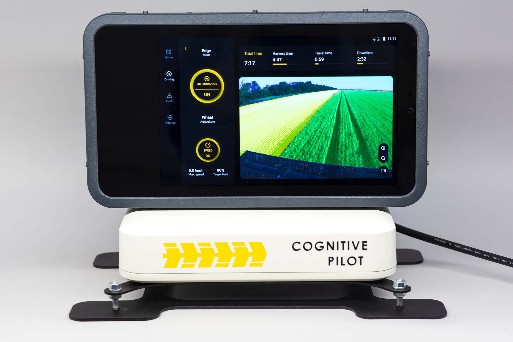
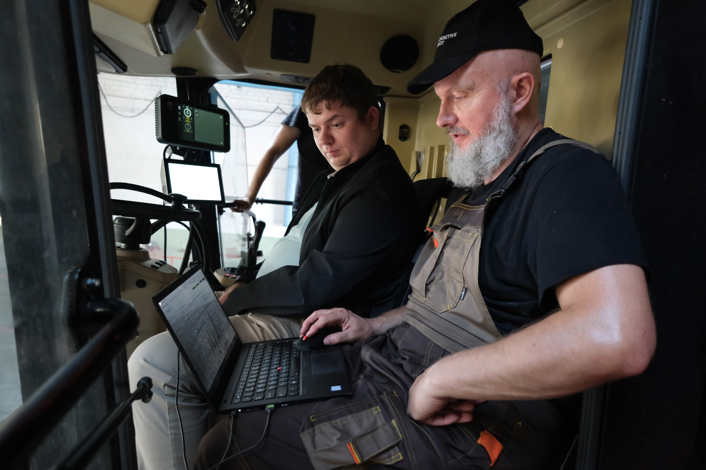

# Cognitive Agro Pilot

_Report on the Application of Artificial Intelligence in Russian Agriculture: Example of the Cognitive Agro Pilot_

Just ten years ago, there were no properly functioning neural networks for detecting obstacles and edges of stem mass, and therefore, video surveillance was nonexistent. "Blind" GPS methods were applied, which proved to be far from the best in practice and significantly undermined the prestige of automation in agriculture.

Leading Russian developer of autonomous control systems for agricultural transport, Cognitive Pilot (a subsidiary of Sberbank and Cognitive Technologies), has developed a new class technology called R2D (Robot to Driver - interaction between the robot and the driver) for agribots. Currently, there are no known analogs.

The Cognitive Agro Pilot system, developed in Russia, represents a more advanced solution for autonomous control of agricultural machinery. It significantly increases the efficiency of the agribusiness but also raises important ethical questions that need to be considered during its implementation.

In addition to creating autonomous control systems for agricultural machinery based on AI, the company actively works on developing service, analytical, telematics, and other solutions that make work in this area as efficient and comfortable as possible.

One of the significant problems with the industrial use of smart autopilots for agricultural machinery was the lack of feedback from the operator or tractor driver with the robot.

To address this and related issues, Cognitive Pilot developed the Cognitive Feedback technology, which allows for monitoring the reliability of AI operation throughout the autopilot's work, as well as interacting with the operator - informing them about the absence of problems and potential cases of unreliable AI operation, as well as warning them about problematic situations that may arise due to adverse weather conditions (dense fog, dust), poor field conditions, contamination of the camera sensor, etc. In such cases, the operator must switch to manual control.

To build a system for assessing the reliability of the AI-based autonomous control system for agricultural machinery, Cognitive Agro Pilot specialists created a new neural network architecture.

Cognitive Feedback allows for the automatic identification of problematic scenes - scenes with low reliability scores from the neural network. These are transmitted to engineers for further analysis of the data locations, and if necessary, the neural network update process is initiated.

The system also enables the collection of analytics, which is crucial for analyzing problematic areas, development, and enhancement of the system. The monitoring subsystem integrated into the Agro Pilot allows for real-time reporting of the combine's movements, speed, and geolocation. Data regarding the work processes from the machine are transmitted via an integrated GSM modem. During the harvesting process, telemetry also records information on the mode of operation of the agro pilot.

The main value of the Cognitive Agro Pilot lies in the neural network trained on a unique volume of data. Since 2012, the team's efforts have been dedicated to creating and accumulating a vast database, which has become one of the largest and the most unique Data Factories in the world.

The Data Factory stores not only raw data or organized information but also prepared (annotated) datasets. In addition to training, there are test samples available. If engineers at a new test site find that the system is not working as expected, it can be tested on these datasets. Sometimes, based on testing results, Data Factory staff need to annotate training samples, for example, adding new classes. However, existing annotations will not be altered unless there are critical errors. The team also monitors the availability of open datasets relevant to their tasks, and when suitable ones are found, they must be utilized in their work.

Until recently, open datasets existed primarily in the field of automotive transport, while only a few datasets were published for agriculture for specific tasks, such as spraying fields with herbicides. The project team decided to change this situation and share their best practices with the community. A project has been launched to prepare the Cognitive Agro Dataset, a universal database of collected real-world data that will allow training neural networks for the automation of agricultural machinery. Images from video cameras and data from odometry sensors and inertial sensors mounted on drones will be available in the Cognitive Agro Dataset.

A global contract with Rusagro for the automation of 242 combines across Russia will lead to an increase in data volumes concerning fields, approaching the ambitions and scales of Zoox. The service agreement with EcoNiva creates optimal conditions for the installation of 10,000 devices within three years.

​The implementation of AI systems, such as the Cognitive Agro Pilot, not only enhances agricultural efficiency but also raises important ethical questions that require attention.​ Addressing these issues through transparency of decisions, data protection, and attention to workers' rights will create a more sustainable and ethical agricultural sector where technologies truly serve the interests of individuals and society.

- Transparency of AI Operations
  The necessity of ensuring transparency in the system's operations. Farmers and workers need to understand how decisions are made based on AI algorithms and how reliable they are. This is especially important for preventing misunderstandings and mistrust of technologies. Addressing this issue includes providing farmers with explanations regarding the decision-making processes of artificial intelligence. Cognitive Feedback is one step in this direction, as it allows mechanisms to inform operators about the state of AI operations and justify recommendations for choosing operational modes.

- Data Rights and Intellectual Property
  The question of who owns the data collected by the system. This includes data on fields and crops, as well as the operational results of the neural network itself. It is important to clearly define data rights to avoid conflicts and misunderstandings. A proper solution here may involve creating agreements between the AI developer and farmers, under conditions of joint use and consideration of both parties' interests.

- Data Privacy
  The confidentiality and security of data transmitted by the system are also crucial aspects. It is necessary to protect farmers' personal and commercially important data from unauthorized access and leaks. In this direction, encryption and other security technologies can be implemented to protect the data transmitted through the Cognitive Agro Pilot system.

- Algorithmic Bias
  The issue of bias in neural networks. Algorithms trained on unbalanced data can lead to erroneous conclusions and incorrect recommendations. To minimize these risks, it is essential to monitor the diversity and representation of data on which neural networks are trained. The Cognitive Agro Pilot actively utilizes the Cognitive Agro Dataset, which not only increases the accuracy of algorithm operations but also contributes to reducing bias.

- Impact on Jobs
  The automation of work may lead to job losses in the agricultural sector. It is important to develop retraining programs for employees who can adapt to new working conditions associated with automation and the introduction of AI. This will help mitigate potential negative consequences for workers and increase trust in new technologies.
